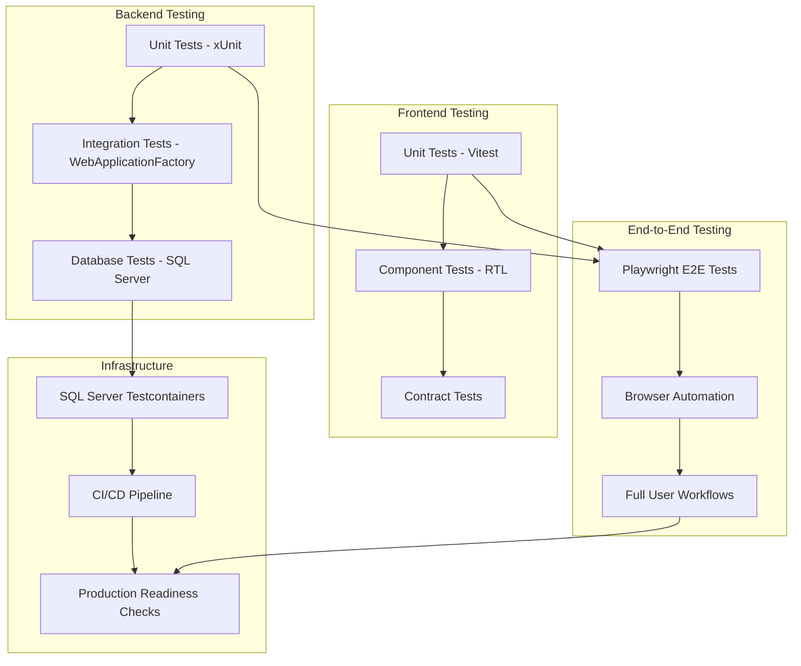

# Design Document

## Overview

This design establishes a comprehensive quality assurance and testing strategy for the Pardis Academy project, transforming it into a production-ready application. The approach focuses on end-to-end correctness, full test coverage, and production readiness without adding new product features. The system consists of a React frontend (Vite + Vitest + React Testing Library), ASP.NET Core backend (xUnit), SQL Server database, and Playwright for E2E testing.

## Architecture

The testing architecture follows a multi-layered approach ensuring comprehensive coverage from unit tests to end-to-end workflows:



## Components and Interfaces

### 1. Frontend Testing Framework

**Purpose**: Comprehensive frontend testing using Vitest and React Testing Library

```typescript
// Test Configuration
interface TestConfig {
  environment: "jsdom";
  globals: boolean;
  setupFiles: string[];
  coverage: {
    provider: "v8";
    reporter: ["text", "json", "html"];
    exclude: string[];
  };
}

// Component Test Interface
interface ComponentTestSuite {
  render: (component: ReactElement) => RenderResult;
  fireEvent: typeof fireEvent;
  waitFor: typeof waitFor;
  screen: typeof screen;
}

// Property-Based Test Interface
interface PropertyTestConfig {
  iterations: number; // minimum 100
  seed: number;
  timeout: number;
}
```

### 2. Backend Testing Framework

**Purpose**: Comprehensive backend testing using xUnit and WebApplicationFactory

```csharp
// Test Server Configuration
public interface ITestServerFactory
{
    WebApplication CreateServer();
    HttpClient CreateClient();
    void SeedDatabase();
    void CleanupDatabase();
}

// Integration Test Base
public abstract class IntegrationTestBase : IDisposable
{
    protected WebApplicationFactory<Program> Factory { get; }
    protected HttpClient Client { get; }
    protected AppDbContext DbContext { get; }
}

// Database Test Configuration
public interface ITestDatabaseConfig
{
    string ConnectionString { get; }
    bool UseTestcontainers { get; }
    bool RunMigrations { get; }
    bool SeedData { get; }
}
```

### 3. E2E Testing Framework

**Purpose**: Browser-based testing using Playwright

```typescript
// Playwright Configuration
interface PlaywrightConfig {
  testDir: string;
  timeout: number;
  retries: number;
  workers: number;
  use: {
    baseURL: string;
    trace: "on-first-retry";
    screenshot: "only-on-failure";
  };
  projects: BrowserProject[];
}

// Page Object Model
interface SliderManagerPage {
  goto(): Promise<void>;
  fillSlideForm(data: SlideFormData): Promise<void>;
  submitForm(): Promise<void>;
  waitForSuccess(): Promise<void>;
  getErrorMessage(): Promise<string>;
  getSlidesList(): Promise<SlideItem[]>;
}
```

### 4. Contract Testing Framework

**Purpose**: Validate frontend-backend API contracts

```typescript
// Contract Test Interface
interface ApiContract {
  endpoint: string;
  method: "GET" | "POST" | "PUT" | "DELETE";
  requestSchema: JSONSchema;
  responseSchema: JSONSchema;
  statusCodes: number[];
}

// Contract Validation
interface ContractValidator {
  validateRequest(data: unknown, schema: JSONSchema): ValidationResult;
  validateResponse(data: unknown, schema: JSONSchema): ValidationResult;
  generateTestData(schema: JSONSchema): unknown;
}
```

## Data Models

### Test Data Models

```typescript
// Frontend Test Models
interface SlideTestData {
  title: string;
  description: string;
  image: string;
  imageFile?: File;
  badge?: string;
  primaryAction?: ActionData;
  secondaryAction?: ActionData;
  slideType: 'permanent' | 'temporary';
  expiresAt?: string;
  order: number;
  isActive: boolean;
}

interface StoryTestData {
  title: string;
  subtitle?: string;
  description: string;
  image: string;
  imageFile?: File;
  type: string;
  storyType: 'permanent' | 'temporary';
  expiresAt?: string;
  duration: number;
  order: number;
  isActive: boolean;
}

// Backend Test Models
public class HeroSlideTestData
{
    public string Title { get; set; } = string.Empty;
    public string? Description { get; set; }
    public string? ImageUrl { get; set; }
    public IFormFile? ImageFile { get; set; }
    public string? Badge { get; set; }
    public string? ButtonText { get; set; }
    public string? ButtonLink { get; set; }
    public int Order { get; set; }
    public bool IsActive { get; set; }
    public bool IsPermanent { get; set; }
    public DateTime? ExpiresAt { get; set; }
}
```

### Database Test Models

```csharp
// Test Database Seeding
public class TestDataSeeder
{
    public static void SeedMinimalData(AppDbContext context)
    {
        // Seed roles
        SeedRoles(context);

        // Seed test users
        SeedTestUsers(context);

        // Seed test categories
        SeedTestCategories(context);

        // Seed test courses
        SeedTestCourses(context);
    }

    public static void CleanupTestData(AppDbContext context)
    {
        // Clean in reverse dependency order
        context.HeroSlides.RemoveRange(context.HeroSlides);
        context.SuccessStories.RemoveRange(context.SuccessStories);
        context.SaveChanges();
    }
}
```

## Implementation Strategy

### 1. Frontend Testing Implementation

**Unit Tests for Data Transformations**:

```typescript
// Property-based tests for data transformation
describe("Data Transformation Properties", () => {
  test("Property: Complete field mapping for slides", () => {
    fc.assert(
      fc.property(slideFormDataArbitrary, (formData) => {
        const apiData = transformSlideFormToApi(formData);

        // Verify all non-empty fields are mapped
        if (formData.title) expect(apiData.get("Title")).toBe(formData.title);
        if (formData.description)
          expect(apiData.get("Description")).toBe(formData.description);

        // Verify dual mapping for buttons
        if (formData.primaryAction?.label) {
          expect(apiData.get("ButtonText")).toBe(formData.primaryAction.label);
          expect(apiData.get("PrimaryActionLabel")).toBe(
            formData.primaryAction.label
          );
        }

        return true;
      }),
      { numRuns: 100 }
    );
  });
});
```

**Component Tests**:

```typescript
// React Testing Library component tests
describe("SliderManager Component", () => {
  test("should render slide form correctly", () => {
    render(<SliderManager />);

    expect(screen.getByLabelText(/title/i)).toBeInTheDocument();
    expect(screen.getByLabelText(/description/i)).toBeInTheDocument();
    expect(screen.getByRole("button", { name: /save/i })).toBeInTheDocument();
  });

  test("should call API with correct parameters on form submission", async () => {
    const mockCreateSlide = vi.fn();
    render(<SliderManager createSlide={mockCreateSlide} />);

    await userEvent.type(screen.getByLabelText(/title/i), "Test Slide");
    await userEvent.click(screen.getByRole("button", { name: /save/i }));

    expect(mockCreateSlide).toHaveBeenCalledWith(
      expect.objectContaining({ title: "Test Slide" })
    );
  });
});
```

### 2. Backend Testing Implementation

**Integration Tests with WebApplicationFactory**:

```csharp
public class HeroSlidesControllerTests : IntegrationTestBase
{
    [Fact]
    public async Task CreateHeroSlide_WithValidData_ReturnsCreatedResult()
    {
        // Arrange
        var slideData = new CreateHeroSlideDto
        {
            Title = "Test Slide",
            Description = "Test Description",
            Order = 1,
            IsPermanent = true
        };

        var formData = new MultipartFormDataContent();
        formData.Add(new StringContent(slideData.Title), "Title");
        formData.Add(new StringContent(slideData.Description), "Description");
        formData.Add(new StringContent(slideData.Order.ToString()), "Order");
        formData.Add(new StringContent(slideData.IsPermanent.ToString()), "IsPermanent");

        // Act
        var response = await Client.PostAsync("/api/HeroSlides", formData);

        // Assert
        response.StatusCode.Should().Be(HttpStatusCode.Created);

        var createdSlide = await DbContext.HeroSlides
            .FirstOrDefaultAsync(s => s.Title == slideData.Title);
        createdSlide.Should().NotBeNull();
    }

    [Theory]
    [InlineData("")]
    [InlineData(null)]
    public async Task CreateHeroSlide_WithInvalidTitle_ReturnsBadRequest(string title)
    {
        // Arrange
        var formData = new MultipartFormDataContent();
        if (title != null)
            formData.Add(new StringContent(title), "Title");

        // Act
        var response = await Client.PostAsync("/api/HeroSlides", formData);

        // Assert
        response.StatusCode.Should().Be(HttpStatusCode.BadRequest);
    }
}
```

**Database Integration Tests**:

```csharp
public class DatabaseIntegrationTests : IDisposable
{
    private readonly SqlServerContainer _container;
    private readonly AppDbContext _context;

    public DatabaseIntegrationTests()
    {
        _container = new SqlServerBuilder()
            .WithImage("mcr.microsoft.com/mssql/server:2022-latest")
            .WithPassword("Test123!")
            .Build();

        _container.StartAsync().Wait();

        var options = new DbContextOptionsBuilder<AppDbContext>()
            .UseSqlServer(_container.GetConnectionString())
            .Options;

        _context = new AppDbContext(options);
        _context.Database.Migrate();
    }

    [Fact]
    public async Task HeroSlide_CRUD_Operations_WorkCorrectly()
    {
        // Create
        var slide = new HeroSlide
        {
            Title = "Test Slide",
            Description = "Test Description",
            Order = 1,
            IsActive = true,
            IsPermanent = true,
            CreatedAt = DateTime.UtcNow
        };

        _context.HeroSlides.Add(slide);
        await _context.SaveChangesAsync();

        // Read
        var retrievedSlide = await _context.HeroSlides
            .FirstOrDefaultAsync(s => s.Title == "Test Slide");
        retrievedSlide.Should().NotBeNull();

        // Update
        retrievedSlide.Description = "Updated Description";
        await _context.SaveChangesAsync();

        var updatedSlide = await _context.HeroSlides
            .FirstOrDefaultAsync(s => s.Id == retrievedSlide.Id);
        updatedSlide.Description.Should().Be("Updated Description");

        // Delete
        _context.HeroSlides.Remove(updatedSlide);
        await _context.SaveChangesAsync();

        var deletedSlide = await _context.HeroSlides
            .FirstOrDefaultAsync(s => s.Id == retrievedSlide.Id);
        deletedSlide.Should().BeNull();
    }
}
```

### 3. E2E Testing Implementation

**Playwright Test Setup**:

```typescript
// playwright.config.ts
export default defineConfig({
  testDir: "./tests/e2e",
  timeout: 30000,
  retries: 2,
  workers: 1,
  use: {
    baseURL: "http://localhost:3000",
    trace: "on-first-retry",
    screenshot: "only-on-failure",
  },
  projects: [
    {
      name: "chromium",
      use: { ...devices["Desktop Chrome"] },
    },
  ],
  webServer: [
    {
      command: "npm run dev",
      port: 3000,
      reuseExistingServer: !process.env.CI,
    },
    {
      command: "dotnet run --project Backend/PardisTousAcademy/Endpoints/Api",
      port: 5000,
      reuseExistingServer: !process.env.CI,
    },
  ],
});
```

**E2E Test Implementation**:

```typescript
// Page Object Model
class SliderManagerPage {
  constructor(private page: Page) {}

  async goto() {
    await this.page.goto("/admin/sliders");
  }

  async fillSlideForm(data: SlideFormData) {
    await this.page.fill('[data-testid="slide-title"]', data.title);
    await this.page.fill('[data-testid="slide-description"]', data.description);

    if (data.imageFile) {
      await this.page.setInputFiles(
        '[data-testid="slide-image"]',
        data.imageFile
      );
    }

    if (data.primaryAction) {
      await this.page.fill(
        '[data-testid="primary-action-label"]',
        data.primaryAction.label
      );
      await this.page.fill(
        '[data-testid="primary-action-link"]',
        data.primaryAction.link
      );
    }
  }

  async submitForm() {
    await this.page.click('[data-testid="save-slide"]');
  }

  async waitForSuccess() {
    await this.page.waitForSelector('[data-testid="success-message"]');
  }

  async getSlidesList() {
    await this.page.waitForSelector('[data-testid="slides-list"]');
    return await this.page.$$eval('[data-testid="slide-item"]', (items) =>
      items.map((item) => ({
        title: item.querySelector('[data-testid="slide-title"]')?.textContent,
        description: item.querySelector('[data-testid="slide-description"]')
          ?.textContent,
      }))
    );
  }
}

// E2E Tests
test.describe("Slider Management E2E", () => {
  test("should create, update, and delete slides", async ({ page }) => {
    const sliderPage = new SliderManagerPage(page);

    // Navigate to slider management
    await sliderPage.goto();

    // Create new slide
    const slideData = {
      title: "E2E Test Slide",
      description: "Created by E2E test",
      primaryAction: {
        label: "Learn More",
        link: "/courses",
      },
    };

    await sliderPage.fillSlideForm(slideData);
    await sliderPage.submitForm();
    await sliderPage.waitForSuccess();

    // Verify slide appears in list
    const slides = await sliderPage.getSlidesList();
    expect(slides).toContainEqual(
      expect.objectContaining({
        title: slideData.title,
        description: slideData.description,
      })
    );

    // Update slide
    await page.click('[data-testid="edit-slide"]:first-child');
    await page.fill('[data-testid="slide-title"]', "Updated E2E Test Slide");
    await sliderPage.submitForm();
    await sliderPage.waitForSuccess();

    // Verify update
    const updatedSlides = await sliderPage.getSlidesList();
    expect(updatedSlides).toContainEqual(
      expect.objectContaining({
        title: "Updated E2E Test Slide",
      })
    );

    // Delete slide
    await page.click('[data-testid="delete-slide"]:first-child');
    await page.click('[data-testid="confirm-delete"]');
    await sliderPage.waitForSuccess();

    // Verify deletion
    const finalSlides = await sliderPage.getSlidesList();
    expect(finalSlides).not.toContainEqual(
      expect.objectContaining({
        title: "Updated E2E Test Slide",
      })
    );
  });
});
```

### 4. Contract Testing Implementation

```typescript
// API Contract Tests
describe("API Contract Tests", () => {
  const heroSlidesContract: ApiContract = {
    endpoint: "/api/HeroSlides",
    method: "POST",
    requestSchema: {
      type: "object",
      required: ["Title"],
      properties: {
        Title: { type: "string", maxLength: 200 },
        Description: { type: "string", maxLength: 500 },
        Order: { type: "integer" },
        IsPermanent: { type: "boolean" },
      },
    },
    responseSchema: {
      type: "object",
      required: ["id", "title"],
      properties: {
        id: { type: "string", format: "uuid" },
        title: { type: "string" },
        description: { type: "string" },
        order: { type: "integer" },
        isActive: { type: "boolean" },
      },
    },
    statusCodes: [201, 400, 401, 403],
  };

  test("should validate request/response contract", async () => {
    const testData = generateTestData(heroSlidesContract.requestSchema);

    // Test request validation
    const requestValidation = validateRequest(
      testData,
      heroSlidesContract.requestSchema
    );
    expect(requestValidation.isValid).toBe(true);

    // Make actual API call
    const response = await api.post(heroSlidesContract.endpoint, testData);

    // Test response validation
    const responseValidation = validateResponse(
      response.data,
      heroSlidesContract.responseSchema
    );
    expect(responseValidation.isValid).toBe(true);

    // Test status code
    expect(heroSlidesContract.statusCodes).toContain(response.status);
  });
});
```

## Error Handling

### Comprehensive Error Testing Strategy

**Network Error Simulation**:

```typescript
// Network error testing
describe("Network Error Handling", () => {
  test("should handle timeout errors", async () => {
    const timeoutError = new Error("timeout");
    timeoutError.code = "ECONNABORTED";

    api.post.mockRejectedValue(timeoutError);

    await expect(
      sliderApiService.createSlide(validSlideData)
    ).rejects.toThrow();
    expect(mockAlert.showError).toHaveBeenCalledWith(
      expect.stringContaining("منقضی شد")
    );
  });

  test("should handle connection refused", async () => {
    const connectionError = new Error("connection refused");
    connectionError.code = "ECONNREFUSED";

    api.post.mockRejectedValue(connectionError);

    await expect(
      sliderApiService.createSlide(validSlideData)
    ).rejects.toThrow();
    expect(mockAlert.showError).toHaveBeenCalledWith(
      expect.stringContaining("اتصال اینترنت")
    );
  });
});
```

**Server Error Testing**:

```csharp
[Theory]
[InlineData(400, "Bad Request")]
[InlineData(401, "Unauthorized")]
[InlineData(403, "Forbidden")]
[InlineData(404, "Not Found")]
[InlineData(500, "Internal Server Error")]
public async Task API_ShouldReturnCorrectStatusCodes(int statusCode, string scenario)
{
    // Arrange - setup conditions for each status code
    switch (statusCode)
    {
        case 400:
            // Send invalid data
            break;
        case 401:
            // Remove authorization header
            break;
        case 403:
            // Use user without permissions
            break;
        case 404:
            // Request non-existent resource
            break;
        case 500:
            // Simulate server error
            break;
    }

    // Act & Assert
    var response = await Client.PostAsync("/api/HeroSlides", content);
    response.StatusCode.Should().Be((HttpStatusCode)statusCode);
}
```

## Testing Strategy

### Dual Testing Approach

**Unit Tests**: Verify specific examples, edge cases, and error conditions

- Data transformation functions
- Validation logic
- Error handling scenarios
- Component rendering and behavior

**Property-Based Tests**: Verify universal properties across all inputs

- API contract compliance
- Data transformation correctness
- Validation consistency
- Round-trip data integrity

**Integration Tests**: Verify component interactions with real dependencies

- HTTP endpoint behavior
- Database operations
- Authentication flows
- File upload handling

**End-to-End Tests**: Verify complete user workflows in browser

- Slide creation, update, deletion
- Form validation and error display
- Authentication and authorization
- File upload workflows

### Test Configuration Requirements

**Property-Based Testing Configuration**:

- Minimum 100 iterations per property test
- Fixed seeds for deterministic results
- Timeout configuration for long-running tests
- Custom generators for domain-specific data

**Database Testing Configuration**:

- Testcontainers for SQL Server (preferred)
- Fallback to dedicated test database
- Automatic migration execution
- Test data seeding and cleanup

**E2E Testing Configuration**:

- Stable, deterministic selectors using data-testid
- Retry configuration for flaky network conditions
- Screenshot capture on failures
- Trace collection for debugging

## Correctness Properties

_A property is a characteristic or behavior that should hold true across all valid executions of a system-essentially, a formal statement about what the system should do. Properties serve as the bridge between human-readable specifications and machine-verifiable correctness guarantees._

### Property 1: End-to-End Slide Creation Consistency

_For any_ valid slide data, creating a slide through the UI should result in the slide being saved to the database and displayed correctly in the UI list
**Validates: Requirements 1.1**

### Property 2: Data Persistence and UI Consistency

_For any_ existing slide and valid update data, updating the slide should persist changes to the database and reflect them in the UI
**Validates: Requirements 1.2**

### Property 3: Deletion Consistency

_For any_ existing slide, deleting it should remove it from both the database and UI display
**Validates: Requirements 1.3**

### Property 4: File Upload Handling

_For any_ valid image file, uploading it as part of slide creation should handle multipart/form-data correctly and store the file appropriately
**Validates: Requirements 1.4**

### Property 5: Validation Error Display

_For any_ invalid slide data, attempting to create or update should display clear, specific error messages in the UI
**Validates: Requirements 1.5**

### Property 6: Authentication Status Codes

_For any_ protected endpoint, accessing it without valid authentication should return 401 status
**Validates: Requirements 2.1**

### Property 7: Authorization Status Codes

_For any_ protected endpoint, accessing it without proper permissions should return 403 status
**Validates: Requirements 2.2**

### Property 8: Token Lifecycle Management

_For any_ expired authentication token, the system should handle renewal or redirect to login appropriately
**Validates: Requirements 2.3**

### Property 9: Authentication Error Handling

_For any_ network error during authentication, the system should provide clear feedback to the user
**Validates: Requirements 2.4**

### Property 10: Successful Authentication Flow

_For any_ valid login credentials, successful authentication should store tokens securely and enable protected features
**Validates: Requirements 2.5**

### Property 11: API Field Mapping Contract

_For any_ frontend form data, the transformed API request should have field names that match backend expectations exactly
**Validates: Requirements 3.1**

### Property 12: Response Format Contract

_For any_ API response, the format should match frontend parsing expectations
**Validates: Requirements 3.2**

### Property 13: Data Type Conversion Consistency

_For any_ data with type differences between frontend and backend, the system should handle conversions correctly
**Validates: Requirements 3.3**

### Property 14: Validation Consistency

_For any_ data with missing required fields, both client and server validation should identify the same issues
**Validates: Requirements 3.4**

### Property 15: Contract Change Detection

_For any_ API contract change, existing tests should fail to prevent silent breakage
**Validates: Requirements 3.5**

### Property 16: Database Error Handling

_For any_ database operation failure, the system should handle errors gracefully and provide appropriate feedback
**Validates: Requirements 4.4**

### Property 17: Data Transformation Correctness

_For any_ input to data transformation functions, the output should match the expected API format exactly
**Validates: Requirements 5.1**

### Property 18: Validation Logic Correctness

_For any_ form data, validation functions should correctly identify valid and invalid inputs
**Validates: Requirements 5.2**

### Property 19: Component Rendering Consistency

_For any_ test data, the SliderManager component should render correctly and display all expected elements
**Validates: Requirements 5.3**

### Property 20: API Call Parameter Correctness

_For any_ form submission, the component should call APIs with correct parameters
**Validates: Requirements 5.4**

### Property 21: Component Error Display

_For any_ API error, components should display appropriate error messages to users
**Validates: Requirements 5.5**

### Property 22: HTTP Response Correctness

_For any_ HTTP endpoint request, responses should have correct status codes and payload formats
**Validates: Requirements 6.1**

### Property 23: Validation Error Response Format

_For any_ validation failure, the system should return 400 status with specific error details
**Validates: Requirements 6.2**

### Property 24: Business Logic Correctness

_For any_ business logic execution, results should match expected outcomes
**Validates: Requirements 6.3**

### Property 25: Data Persistence Correctness

_For any_ database operation, data should be persisted correctly and retrievable
**Validates: Requirements 6.4**

### Property 26: E2E Workflow Completion

_For any_ slide creation workflow in the browser, the complete process from form to database should work correctly
**Validates: Requirements 7.2**

### Property 27: UI Update Consistency

_For any_ slide update operation, changes should be visible in the UI after save
**Validates: Requirements 7.3**

### Property 28: UI Deletion Consistency

_For any_ slide deletion operation, the item should be removed from the UI list
**Validates: Requirements 7.4**

### Property 29: Network Timeout Handling

_For any_ network request that times out, the system should show appropriate error messages
**Validates: Requirements 8.1**

### Property 30: Server Error Handling

_For any_ 500-level server error, the system should handle it gracefully
**Validates: Requirements 8.2**

### Property 31: Validation Error Field Display

_For any_ server validation failure, the client should display specific field errors
**Validates: Requirements 8.3**

### Property 32: Offline Status Indication

_For any_ offline condition, the system should indicate connection status appropriately
**Validates: Requirements 8.4**

### Property 33: Retry Logic Behavior

_For any_ failed request that should be retried, the system should use exponential backoff
**Validates: Requirements 8.5**

### Property 34: Sensitive Data Protection

_For any_ system operation, logs should not contain sensitive data
**Validates: Requirements 10.4**

### Property 35: HTTP Status Code Consistency

_For any_ HTTP response, status codes should be consistent and correct across all endpoints
**Validates: Requirements 10.5**
