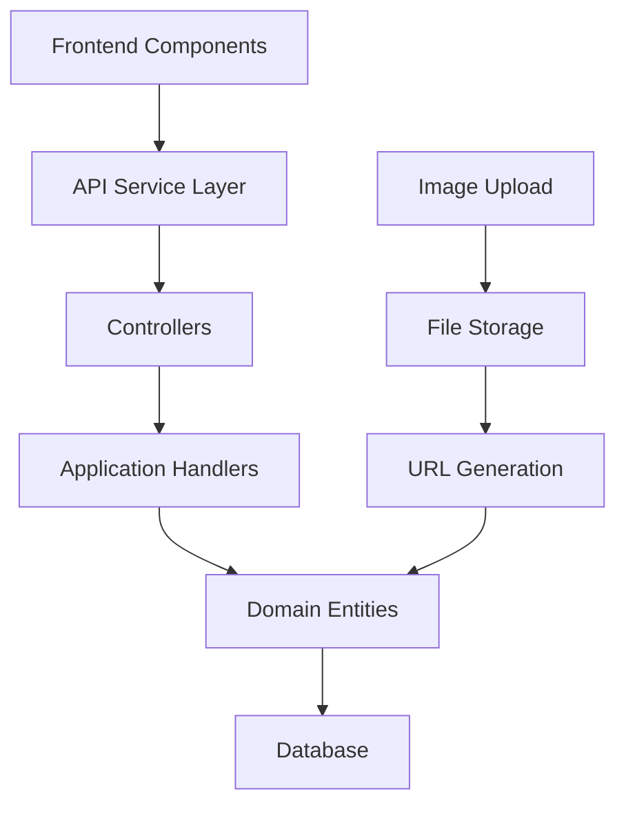

# Design Document

## Overview

This design simplifies the slider system by removing unnecessary complexity while maintaining core functionality. The solution focuses on essential fields only, proper image upload handling, and seamless frontend-backend synchronization. The architecture follows clean separation of concerns with simplified entities, DTOs, and API endpoints.

## Architecture

The simplified slider system follows a layered architecture with minimal complexity:



## Components and Interfaces

### 1. Simplified Domain Entities

**HeroSlide Entity (Simplified)**:

```csharp
public class HeroSlide : BaseEntity
{
    [Required]
    [MaxLength(200)]
    public required string Title { get; set; }

    [MaxLength(500)]
    public string? Description { get; set; }

    [Required]
    [MaxLength(500)]
    public required string ImageUrl { get; set; }

    [MaxLength(100)]
    public string? ActionLabel { get; set; }

    [MaxLength(500)]
    public string? ActionLink { get; set; }

    public int Order { get; set; } = 0;
    public bool IsActive { get; set; } = true;
    public Guid CreatedByUserId { get; set; }
}
```

**SuccessStory Entity (Simplified)**:

```csharp
public class SuccessStory : BaseEntity
{
    [Required]
    [MaxLength(200)]
    public required string Title { get; set; }

    [MaxLength(500)]
    public string? Description { get; set; }

    [Required]
    [MaxLength(500)]
    public required string ImageUrl { get; set; }

    [MaxLength(100)]
    public string? ActionLabel { get; set; }

    [MaxLength(500)]
    public string? ActionLink { get; set; }

    public int Order { get; set; } = 0;
    public bool IsActive { get; set; } = true;
    public Guid CreatedByUserId { get; set; }
}
```

### 2. Simplified DTOs

**Create/Update DTOs**:

```csharp
public class CreateHeroSlideDto
{
    [Required(ErrorMessage = "عنوان الزامی است")]
    [MaxLength(200)]
    public string Title { get; set; } = string.Empty;

    [MaxLength(500)]
    public string? Description { get; set; }

    public IFormFile? ImageFile { get; set; }

    [MaxLength(500)]
    public string? ImageUrl { get; set; }

    [MaxLength(100)]
    public string? ActionLabel { get; set; }

    [MaxLength(500)]
    public string? ActionLink { get; set; }

    public int Order { get; set; } = 0;
}

public class UpdateHeroSlideDto
{
    [MaxLength(200)]
    public string? Title { get; set; }

    [MaxLength(500)]
    public string? Description { get; set; }

    public IFormFile? ImageFile { get; set; }

    [MaxLength(500)]
    public string? ImageUrl { get; set; }

    [MaxLength(100)]
    public string? ActionLabel { get; set; }

    [MaxLength(500)]
    public string? ActionLink { get; set; }

    public int? Order { get; set; }
    public bool? IsActive { get; set; }
}
```

**Response DTOs**:

```csharp
public class HeroSlideResource
{
    public Guid Id { get; set; }
    public string Title { get; set; } = string.Empty;
    public string? Description { get; set; }
    public string ImageUrl { get; set; } = string.Empty;
    public string? ActionLabel { get; set; }
    public string? ActionLink { get; set; }
    public int Order { get; set; }
    public bool IsActive { get; set; }
    public DateTime CreatedAt { get; set; }
    public DateTime UpdatedAt { get; set; }
}
```

### 3. Frontend Data Models

**Frontend Form Models**:

```typescript
interface SliderFormData {
  id?: string;
  title: string; // Required
  description?: string;
  imageFile?: File; // For upload
  imageUrl?: string; // For existing images
  actionLabel?: string;
  actionLink?: string;
  order: number;
  isActive: boolean;
}

interface SliderDisplayData {
  id: string;
  title: string;
  description?: string;
  image: string; // Always contains the URL
  action?: {
    label: string;
    link: string;
  };
  order: number;
  isActive: boolean;
}
```

## Data Models

### Database Schema Changes

**Remove Complex Columns**:

- Remove `Badge`, `PrimaryActionLabel`, `PrimaryActionLink`, `SecondaryActionLabel`, `SecondaryActionLink`
- Remove `StatsJson`, `IsPermanent`, `ExpiresAt`
- Remove `StudentName`, `CourseName`, `Type`, `Duration` from SuccessStory
- Keep only: `Title`, `Description`, `ImageUrl`, `ActionLabel`, `ActionLink`, `Order`, `IsActive`

**Migration Strategy**:

```sql
-- Migrate existing data to simplified structure
UPDATE HeroSlides SET
    ActionLabel = COALESCE(PrimaryActionLabel, ButtonText),
    ActionLink = COALESCE(PrimaryActionLink, LinkUrl)
WHERE ActionLabel IS NULL;

-- Remove unused columns (after data migration)
ALTER TABLE HeroSlides DROP COLUMN Badge;
ALTER TABLE HeroSlides DROP COLUMN PrimaryActionLabel;
ALTER TABLE HeroSlides DROP COLUMN PrimaryActionLink;
ALTER TABLE HeroSlides DROP COLUMN SecondaryActionLabel;
ALTER TABLE HeroSlides DROP COLUMN SecondaryActionLink;
ALTER TABLE HeroSlides DROP COLUMN StatsJson;
ALTER TABLE HeroSlides DROP COLUMN IsPermanent;
ALTER TABLE HeroSlides DROP COLUMN ExpiresAt;
```

## Implementation Strategy

### 1. Backend Simplification

**Entity Updates**:

- Remove complex properties from domain entities
- Update factory methods to use simplified parameters
- Remove expiration and stats logic

**DTO Simplification**:

- Create new simplified DTOs
- Remove complex validation logic
- Focus on essential field validation

**API Endpoints**:

- Update controllers to use simplified DTOs
- Remove complex query parameters
- Simplify response structures

### 2. Frontend Simplification

**Component Updates**:

```typescript
// Simplified HeroSlider component
const HeroSlider = ({ slides }) => {
  return (
    <div className="hero-slider">
      {slides.map((slide) => (
        <div key={slide.id} className="slide">
          
          <div className="content">
            <h1>{slide.title}</h1>
            {slide.description && <p>{slide.description}</p>}
            {slide.action && (
              <button onClick={() => navigate(slide.action.link)}>
                {slide.action.label}
              </button>
            )}
          </div>
        </div>
      ))}
    </div>
  );
};
```

**API Service Simplification**:

```typescript
class SimplifiedSliderService {
  async createSlide(data: SliderFormData) {
    const formData = new FormData();
    formData.append("Title", data.title);
    if (data.description) formData.append("Description", data.description);
    if (data.imageFile) formData.append("ImageFile", data.imageFile);
    else if (data.imageUrl) formData.append("ImageUrl", data.imageUrl);
    if (data.actionLabel) formData.append("ActionLabel", data.actionLabel);
    if (data.actionLink) formData.append("ActionLink", data.actionLink);
    formData.append("Order", data.order.toString());

    return api.post("/HeroSlides", formData);
  }
}
```

### 3. Image Upload Handling

**Backend Image Processing**:

```csharp
public async Task<string> HandleImageUpload(IFormFile imageFile)
{
    if (imageFile == null) return null;

    // Validate file
    var allowedTypes = new[] { "image/jpeg", "image/png", "image/webp" };
    if (!allowedTypes.Contains(imageFile.ContentType))
        throw new ValidationException("نوع فایل مجاز نیست");

    if (imageFile.Length > 5 * 1024 * 1024) // 5MB
        throw new ValidationException("حجم فایل بیش از حد مجاز است");

    // Generate unique filename
    var fileName = $"{Guid.NewGuid()}{Path.GetExtension(imageFile.FileName)}";
    var filePath = Path.Combine("wwwroot/uploads/sliders", fileName);

    // Save file
    using var stream = new FileStream(filePath, FileMode.Create);
    await imageFile.CopyToAsync(stream);

    return $"/uploads/sliders/{fileName}";
}
```

## Error Handling

### Simplified Validation

**Backend Validation**:

- Required field validation for Title
- Image requirement (either file or URL)
- File type and size validation
- URL format validation

**Frontend Validation**:

```typescript
function validateSliderForm(data: SliderFormData): ValidationResult {
  const errors: Record<string, string> = {};

  if (!data.title?.trim()) {
    errors.title = "عنوان الزامی است";
  }

  if (!data.imageFile && !data.imageUrl?.trim()) {
    errors.image = "تصویر الزامی است";
  }

  if (data.actionLabel && !data.actionLink?.trim()) {
    errors.actionLink = "لینک اکشن الزامی است";
  }

  return {
    isValid: Object.keys(errors).length === 0,
    errors,
  };
}
```

## Testing Strategy

### Unit Tests

- Test simplified entity creation and updates
- Test DTO validation with essential fields only
- Test image upload functionality
- Test API endpoints with simplified data

### Integration Tests

- Test complete create/update/delete flows
- Test frontend-backend data synchronization
- Test image upload and URL generation
- Test migration from complex to simplified structure

### Property-Based Tests

- Generate random slider data and verify API transformation
- Test that all required fields are properly validated
- Verify that simplified structure maintains data integrity

## Correctness Properties

_A property is a characteristic or behavior that should hold true across all valid executions of a system-essentially, a formal statement about what the system should do. Properties serve as the bridge between human-readable specifications and machine-verifiable correctness guarantees._

### Property 1: Entity Structure Simplification

_For any_ HeroSlider or SuccessStory entity instance, it should contain exactly the core fields (Title, Description, ImageUrl, ActionLabel, ActionLink, Order, IsActive) and none of the complex fields (Stats, Badge, Secondary Actions, Expiration flags)
**Validates: Requirements 1.1, 1.2, 2.1, 2.2, 6.1**

### Property 2: Required Field Validation

_For any_ slider creation or update request, validation should fail if and only if required fields (Title, ImageUrl or ImageFile) are missing or empty
**Validates: Requirements 1.5, 2.5, 3.4**

### Property 3: Image Upload Processing

_For any_ valid image file upload, the system should store the file securely and generate a valid, accessible URL that can be used to retrieve the image
**Validates: Requirements 3.1, 3.2**

### Property 4: File Validation

_For any_ image file upload attempt, the system should accept only valid image types (JPEG, PNG, WebP) within size limits and reject all other files with appropriate error messages
**Validates: Requirements 3.5**

### Property 5: Frontend-Backend Data Mapping

_For any_ slider data sent from frontend to backend, all field names and values should be correctly mapped and preserved during the transformation process
**Validates: Requirements 4.1, 4.3**

### Property 6: Partial Update Handling

_For any_ slider update request with partial data, only the provided fields should be modified while preserving all other existing field values
**Validates: Requirements 4.4, 3.3**

### Property 7: API Response Structure

_For any_ API response from slider endpoints, the returned data should contain only the essential simplified fields and follow consistent response format across all endpoints
**Validates: Requirements 5.4, 5.5**

### Property 8: Component Display Consistency

_For any_ slider component rendering, only the essential elements (Title, Description, Image, Action button) should be displayed, and missing optional fields should not cause rendering errors
**Validates: Requirements 7.1, 7.2, 7.4**

### Property 9: Entity Structure Consistency

_For any_ HeroSlider and SuccessStory entities, they should have identical field structures and types to maintain consistency across the slider system
**Validates: Requirements 2.4**

### Property 10: Migration Data Preservation

_For any_ existing slider data during migration, the essential fields (Title, Description, ImageUrl, primary action) should be preserved and correctly mapped to the new simplified structure
**Validates: Requirements 8.1, 8.2, 8.3, 8.4**

### Property 11: Legacy Code Elimination

_For any_ system component after simplification, no expiration logic, temporary slide features, or complex legacy properties should remain in the codebase
**Validates: Requirements 6.2, 6.3**
