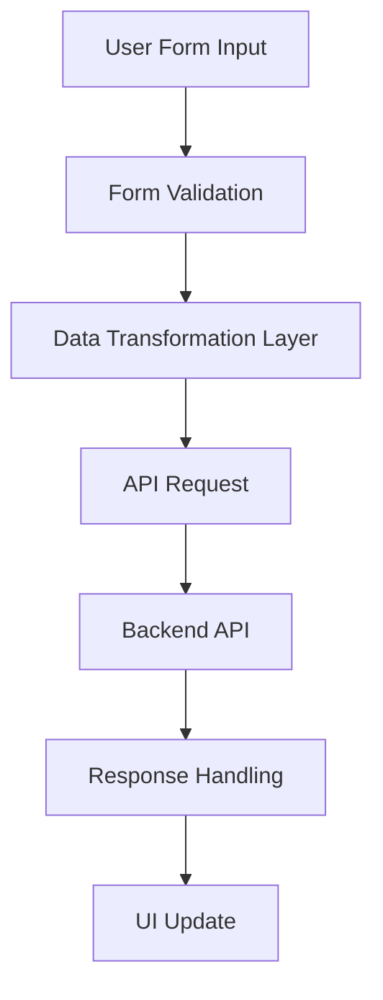

# Design Document

## Overview

This design addresses the API integration issues in the SliderManager component by implementing proper field mapping between the frontend form data and the backend API expectations. The main issue is that the frontend is sending incorrect field names to the HeroSlides and SuccessStories APIs, causing validation errors.

## Architecture

The solution follows a data transformation pattern where form data is mapped to API-expected formats before making HTTP requests. This ensures compatibility between the React frontend and the .NET backend API.



## Components and Interfaces

### 1. Data Transformation Functions

**Purpose**: Convert frontend form data to API-expected format

```typescript
interface SlideFormData {
  title: string;
  description: string;
  image: string;
  badge?: string;
  primaryAction?: { label: string; link: string };
  secondaryAction?: { label: string; link: string };
  slideType: "permanent" | "temporary";
  expiresAt?: string;
  order: number;
  isActive: boolean;
}

interface HeroSlideApiData {
  Title: string;
  Description?: string;
  ImageUrl?: string;
  ImageFile?: File;
  Badge?: string;
  ButtonText?: string;
  ButtonLink?: string;
  PrimaryActionLabel?: string;
  PrimaryActionLink?: string;
  SecondaryActionLabel?: string;
  SecondaryActionLink?: string;
  Order: number;
  IsActive: boolean;
  IsPermanent: boolean;
  ExpiresAt?: string;
}
```

### 2. API Service Layer

**Purpose**: Handle HTTP requests with proper error handling

```typescript
class SliderApiService {
  async createSlide(formData: SlideFormData): Promise<ApiResponse>;
  async updateSlide(id: string, formData: SlideFormData): Promise<ApiResponse>;
  async deleteSlide(id: string): Promise<ApiResponse>;
  async createStory(formData: StoryFormData): Promise<ApiResponse>;
  async updateStory(id: string, formData: StoryFormData): Promise<ApiResponse>;
  async deleteStory(id: string): Promise<ApiResponse>;
}
```

### 3. Form Validation Layer

**Purpose**: Validate form data before API submission

```typescript
interface ValidationResult {
  isValid: boolean;
  errors: Record<string, string>;
}

function validateSlideForm(data: SlideFormData): ValidationResult;
function validateStoryForm(data: StoryFormData): ValidationResult;
```

## Data Models

### Frontend Form Models

```typescript
interface SlideFormData {
  id?: string;
  title: string; // Required
  description: string;
  image: string; // URL or file path
  imageFile?: File; // Uploaded file
  badge?: string;
  primaryAction?: {
    label: string;
    link: string;
  };
  secondaryAction?: {
    label: string;
    link: string;
  };
  slideType: "permanent" | "temporary";
  expiresAt?: string;
  order: number;
  isActive: boolean;
}

interface StoryFormData {
  id?: string;
  title: string; // Required
  subtitle?: string;
  description: string;
  image: string; // URL or file path
  imageFile?: File; // Uploaded file
  type: "success" | "video" | "testimonial";
  storyType: "permanent" | "temporary";
  expiresAt?: string;
  duration: number;
  order: number;
  action?: {
    label: string;
    link: string;
  };
  isActive: boolean;
}
```

### API Request Models

```typescript
interface HeroSlideCreateRequest {
  Title: string; // Required - maps from title
  Description?: string; // maps from description
  ImageUrl?: string; // maps from image (if URL)
  ImageFile?: File; // maps from imageFile
  Badge?: string; // maps from badge
  ButtonText?: string; // maps from primaryAction.label
  ButtonLink?: string; // maps from primaryAction.link
  PrimaryActionLabel?: string; // maps from primaryAction.label
  PrimaryActionLink?: string; // maps from primaryAction.link
  SecondaryActionLabel?: string; // maps from secondaryAction.label
  SecondaryActionLink?: string; // maps from secondaryAction.link
  Order: number; // maps from order
  IsPermanent: boolean; // maps from slideType === 'permanent'
  ExpiresAt?: string; // maps from expiresAt (ISO format)
}

interface HeroSlideUpdateRequest extends HeroSlideCreateRequest {
  IsActive: boolean; // maps from isActive
}

interface SuccessStoryCreateRequest {
  Title: string; // Required - maps from title
  Subtitle?: string; // maps from subtitle
  Description?: string; // maps from description
  ImageUrl?: string; // maps from image (if URL)
  ImageFile?: File; // maps from imageFile
  Type: string; // maps from type
  Order: number; // maps from order
  IsPermanent: boolean; // maps from storyType === 'permanent'
  ExpiresAt?: string; // maps from expiresAt (ISO format)
}

interface SuccessStoryUpdateRequest extends SuccessStoryCreateRequest {
  IsActive: boolean; // maps from isActive
}
```

## Implementation Strategy

### 1. Data Transformation Functions

Create utility functions to transform form data to API format:

```typescript
function transformSlideFormToApi(formData: SlideFormData): FormData {
  const apiData = new FormData();

  // Required fields
  apiData.append("Title", formData.title);

  // Optional fields with proper mapping
  if (formData.description) apiData.append("Description", formData.description);
  if (formData.badge) apiData.append("Badge", formData.badge);

  // Handle image - prioritize file over URL
  if (formData.imageFile) {
    apiData.append("ImageFile", formData.imageFile);
  } else if (formData.image && formData.image.startsWith("http")) {
    apiData.append("ImageUrl", formData.image);
  }

  // Button actions - send both formats for compatibility
  if (formData.primaryAction?.label) {
    apiData.append("ButtonText", formData.primaryAction.label);
    apiData.append("PrimaryActionLabel", formData.primaryAction.label);
  }
  if (formData.primaryAction?.link) {
    apiData.append("ButtonLink", formData.primaryAction.link);
    apiData.append("PrimaryActionLink", formData.primaryAction.link);
  }

  // Secondary actions
  if (formData.secondaryAction?.label) {
    apiData.append("SecondaryActionLabel", formData.secondaryAction.label);
  }
  if (formData.secondaryAction?.link) {
    apiData.append("SecondaryActionLink", formData.secondaryAction.link);
  }

  // Slide type and expiration
  apiData.append(
    "IsPermanent",
    (formData.slideType === "permanent").toString()
  );
  if (formData.slideType === "temporary" && formData.expiresAt) {
    apiData.append("ExpiresAt", formData.expiresAt);
  }

  // Other fields
  apiData.append("Order", formData.order.toString());

  return apiData;
}

function transformSlideFormToApiForUpdate(formData: SlideFormData): FormData {
  const apiData = transformSlideFormToApi(formData);
  apiData.append("IsActive", formData.isActive.toString());
  return apiData;
}
```

### 2. Updated API Methods

Modify the existing API methods to use proper data transformation:

```typescript
const createSlide = async (slideData: SlideFormData) => {
  try {
    setLoading(true);
    const formData = transformSlideFormToApi(slideData);

    const response = await api.post("/HeroSlides", formData, {
      headers: { "Content-Type": "multipart/form-data" },
    });

    await loadSlides();
    alert.showSuccess("اسلاید با موفقیت ایجاد شد");
    return response.data;
  } catch (error) {
    console.error("Error creating slide:", error);
    handleApiError(error);
    throw error;
  } finally {
    setLoading(false);
  }
};

const updateSlide = async (id: string, slideData: SlideFormData) => {
  try {
    setLoading(true);
    const formData = transformSlideFormToApiForUpdate(slideData);

    const response = await api.put(`/HeroSlides/${id}`, formData, {
      headers: { "Content-Type": "multipart/form-data" },
    });

    await loadSlides();
    alert.showSuccess("اسلاید با موفقیت به‌روزرسانی شد");
    return response.data;
  } catch (error) {
    console.error("Error updating slide:", error);
    handleApiError(error);
    throw error;
  } finally {
    setLoading(false);
  }
};
```

### 3. Form Validation

Add client-side validation before API calls:

```typescript
function validateSlideForm(data: SlideFormData): ValidationResult {
  const errors: Record<string, string> = {};

  if (!data.title?.trim()) {
    errors.title = "عنوان الزامی است";
  }

  if (!data.image?.trim() && !data.imageFile) {
    errors.image = "تصویر الزامی است";
  }

  if (data.title && data.title.length > 200) {
    errors.title = "عنوان نباید بیش از 200 کاراکتر باشد";
  }

  if (data.description && data.description.length > 500) {
    errors.description = "توضیحات نباید بیش از 500 کاراکتر باشد";
  }

  return {
    isValid: Object.keys(errors).length === 0,
    errors,
  };
}
```

### 4. Error Handling

Improve error handling to show specific validation messages:

```typescript
function handleApiError(error: any) {
  if (error.response?.status === 400) {
    const validationErrors = error.response.data?.errors;
    if (validationErrors) {
      // Show specific field errors
      Object.keys(validationErrors).forEach((field) => {
        const messages = validationErrors[field];
        if (Array.isArray(messages)) {
          alert.showError(`${field}: ${messages.join(", ")}`);
        }
      });
    } else {
      alert.showError("اطلاعات وارد شده نامعتبر است");
    }
  } else {
    alert.showError("خطا در ارتباط با سرور");
  }
}
```

## Error Handling

### Client-Side Validation

- Validate required fields before API submission
- Check field length limits based on API constraints
- Validate image URL format or file type

### API Error Handling

- Parse 400 Bad Request responses for specific field errors
- Show user-friendly error messages in Persian
- Maintain form state on validation errors

### Network Error Handling

- Handle connection timeouts
- Retry failed requests with exponential backoff
- Show offline indicators when appropriate

## Testing Strategy

### Unit Tests

- Test data transformation functions with various input combinations
- Test form validation logic with valid and invalid data
- Test error handling with different API response scenarios

### Integration Tests

- Test complete create/update/delete flows
- Test image upload and URL handling
- Test temporary slide expiration logic

### Property-Based Tests

- Generate random form data and verify API transformation
- Test that all required fields are properly mapped
- Verify that validation catches all invalid inputs

The testing approach will use both unit tests for specific functions and property-based tests to verify the transformation logic works correctly across all possible input combinations.

## Correctness Properties

_A property is a characteristic or behavior that should hold true across all valid executions of a system-essentially, a formal statement about what the system should do. Properties serve as the bridge between human-readable specifications and machine-verifiable correctness guarantees._

### Property 1: Complete Field Mapping for Slides

_For any_ valid SlideFormData, the transformation function should produce FormData containing all non-empty form fields mapped to their correct API field names, including dual mapping for button fields (ButtonText/PrimaryActionLabel and ButtonLink/PrimaryActionLink)
**Validates: Requirements 1.1, 1.2, 1.3, 1.4, 1.5**

### Property 2: Image Handling Priority

_For any_ SlideFormData with image data, if both imageFile and image URL are provided, the transformation should include only ImageFile in the output; if only image URL is provided, it should include only ImageUrl; if neither is provided, validation should fail
**Validates: Requirements 2.1, 2.2, 2.3, 2.4**

### Property 3: Slide Type and Expiration Mapping

_For any_ SlideFormData, when slideType is "permanent", IsPermanent should be true and ExpiresAt should be omitted; when slideType is "temporary", IsPermanent should be false and ExpiresAt should be included if provided
**Validates: Requirements 3.1, 3.2, 3.3**

### Property 4: Data Type Conversion

_For any_ SlideFormData with numeric order value, the transformation should convert it to string format in FormData while preserving the numeric value
**Validates: Requirements 3.4**

### Property 5: Update vs Create Field Differences

_For any_ SlideFormData, the update transformation should include all fields from create transformation plus the IsActive field
**Validates: Requirements 4.1**

### Property 6: Form Validation Completeness

_For any_ SlideFormData, validation should fail if and only if title is empty/whitespace or no image data (URL or file) is provided
**Validates: Requirements 5.1, 2.4**

### Property 7: Success Story Field Mapping

_For any_ valid StoryFormData, the transformation function should produce FormData containing all non-empty form fields mapped to their correct API field names, including Title, Subtitle, Description, and Type
**Validates: Requirements 6.1, 6.2, 6.3**

### Property 8: Round-trip Data Integrity

_For any_ valid form data that passes validation, transforming to API format and then parsing the FormData entries should preserve all the original field values (accounting for type conversions)
**Validates: Requirements 1.1, 6.1**
